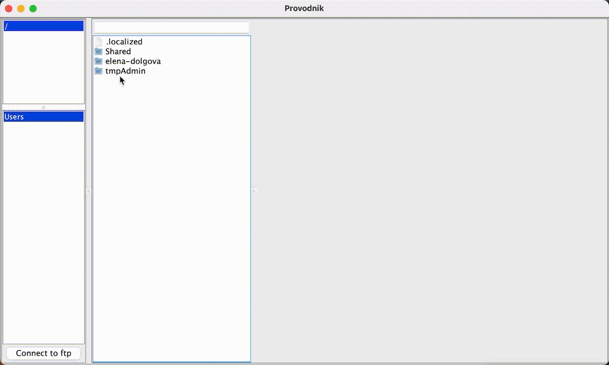

# Provodnik
Provodnik - a program that allows you to view files from local disks, in zip archives and on ftp servers.
Any nesting of zip archives into each other is supported. Unix and Windows OS are supported.

# Functionality
- Viewing the contents of local disks.
- Viewing the contents of zip archives.
  
- Viewing the contents of ftp servers.
  
- Preview of text files and images.
- Filtering files by extension. For example, to get the extension file "image.png", you need to enter "png".
- Navigation is performed by double-clicking and using key "enter" or key "esc" buttons.
- Directories that can be visited are displayed in blue.

# Requirements
Java 11

# Implementation
## Local and zip directories
The java.nio.file library is used to read and view local and zip directories.

## FTP server
To read and view ftp servers, the library's FTP Client client is used apache.commons.net.
For quickly view the contents of ftp servers, was used loading files via org.apache.commons.net.ftp.FTPListParseEngine.

For viewing zip archives on ftp servers, Provodnik downloads a file. 
Caching of downloaded zip files from ftp servers is supported. 
Caching images is supported too through com.github.benmanes.caffeine.cache.Caffeine.